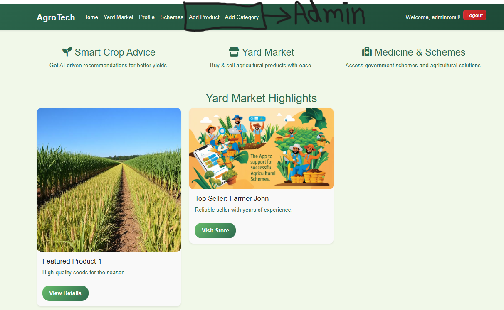
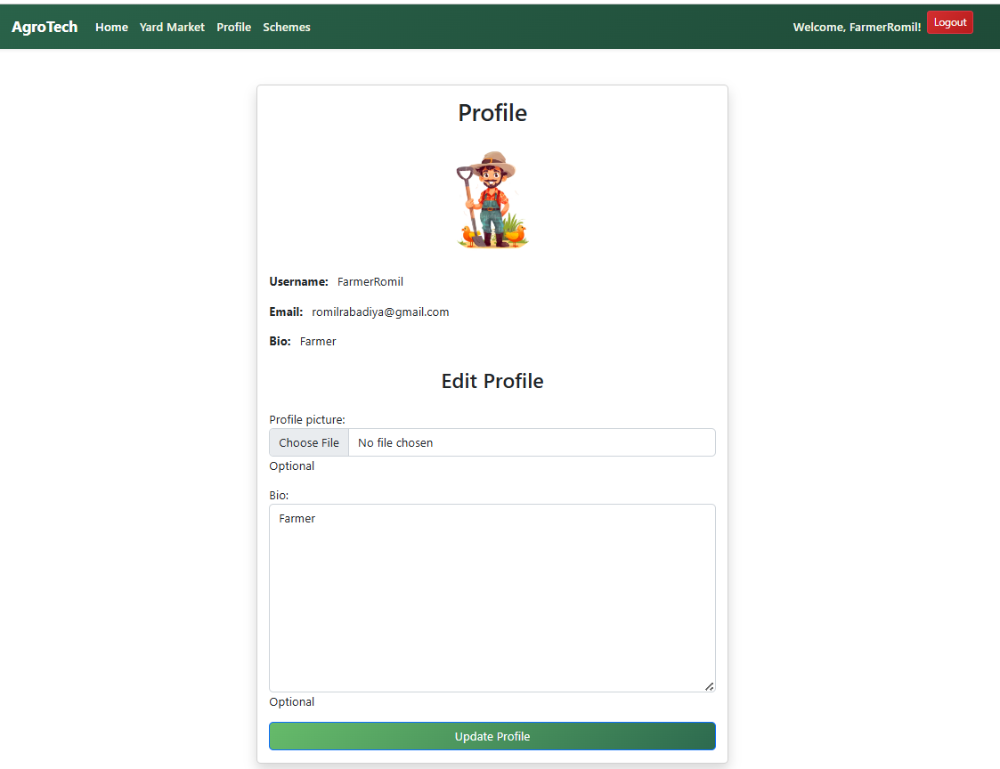
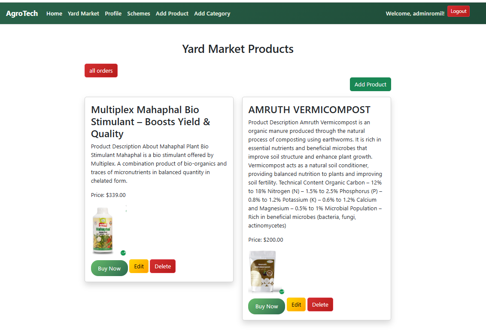
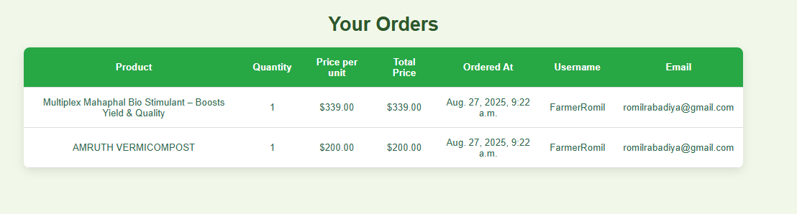
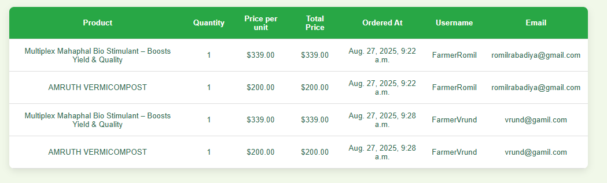
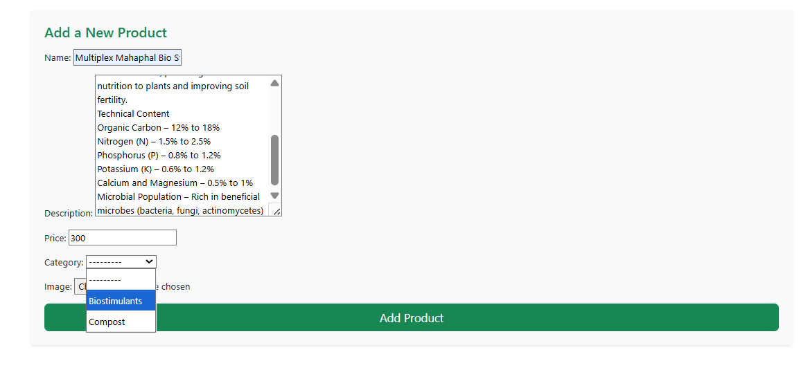
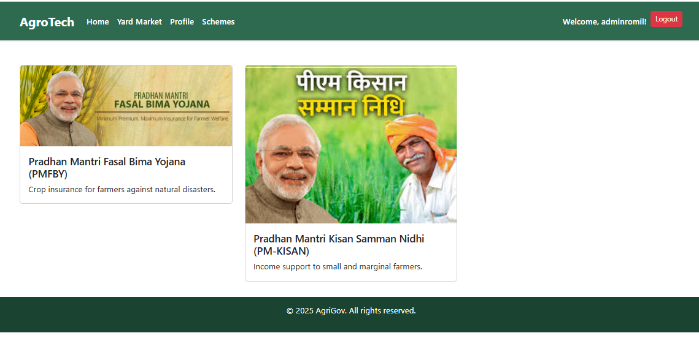

# AgroTech - Agricultural Management Platform

A Django-based web app that connects farmers, administrators, and agricultural stakeholders.
It provides a marketplace for products, and user management.

---

## ⚙️ Technology Stack

AgroTech is built using a modern, reliable, and scalable technology stack to ensure smooth performance and maintainability:

* **Backend**: Powered by Django (Python web framework) for robust server-side logic, secure authentication, and efficient database handling.
* **Frontend**: Developed with HTML5, CSS3, JavaScript, and Bootstrap 5.3 for a clean, responsive, and mobile-friendly user interface.
* **Database**: Uses SQLite (default Django database) for development and testing. Can be easily scaled to PostgreSQL or MySQL in production.
* **Authentication & Authorization**: Custom Django User Model with role-based access (Farmers & Administrators), secured by Django’s built-in authentication system.
* **File Management**: Integrated Django media handling for uploading and managing profile pictures, product images, and other media files.

---

## 📸 Screenshots

**Admin Dashboard**:


**Farmer Dashboard**:


---

## 🌟 Features

AgroTech provides a complete digital platform for farmers and administrators. It brings together marketplace features, government scheme details, and profile management into one easy-to-use system.

---

### 👤 User Management

#### Role-based Access

There are two types of users:

* **Farmers**: Can browse products, place orders, and check government schemes.
* **Administrators**: Can manage products, categories, orders, and users.

Each role has different permissions, ensuring everyone gets access only to what they need.

#### Custom Profiles

* Farmers can add details like farm size, crop types, and preferred farming methods.
* Administrators can add their department and designation.
* Every user can upload a profile picture and update contact details.

#### Profile Editing

* Users can update their information anytime through a simple form.
* The system checks the data before saving, so mistakes are avoided.

#### Automatic Profile Creation

* When a new user signs up, their profile is created automatically in the background.
* Farmers get farmer-specific fields, and administrators get admin-related fields without needing to set it up manually.

**User Profile Page**:


---

### 🛒 Yard Market (E-commerce for Agriculture)

The Yard Market is the heart of AgroTech. It acts like an online agricultural shop where farmers can browse, order, and manage products.

#### 📦 Product Catalog

Displays all available agricultural products with:

* High-quality images for easy identification.
* Detailed descriptions including product benefits, usage instructions, and manufacturer details.
* Price and stock availability information updated in real-time.
* Category-based browsing (Seeds, Fertilizers, Tools, Equipment, etc.).
* Products are displayed in a responsive grid layout, making it easy to browse on mobile or desktop.

**Product List For Farmer And Admin**:


#### 📑 Order Placement

* **One-Click Ordering**: Farmers can simply click the “Buy” button on a product, and the order is instantly placed without requiring a lengthy checkout process.

**Order History For Farmer**:


#### 🧑‍💼 Order Management for Administrators

* Admins can view and manage all orders placed by all farmers.
* Each order has detailed information (Farmer’s name, address, product details, payment mode).

**All Order History Of Admin**:


---

### 🛠️ Product Management (Admin Only)

Admins can:

* Add new products with details like price, description, image, and stock count.
* Edit product details (price updates, new images, revised descriptions).
* Manage inventory (update stock when products are sold or restocked).
* Delete outdated products no longer available.

The system prevents duplicate product entries and ensures farmers only see available stock.

**Product Add Page For Admin**:


---

### 🏷️ Category Management (Admin Only)

* Products are grouped under categories and subcategories.

**Example:**

* Seeds → Vegetables, Fruits, Grains
* Fertilizers → Organic, Chemical
* Tools → Manual, Powered Equipment

Admins can create new categories, rename existing ones, or remove unused ones.
Helps farmers easily navigate and find products faster.

---

### 🏛️ Government Schemes

#### Scheme Information

Farmers can find a list of government schemes, policies, and subsidies in one place.

Each scheme page shows:

* Who can apply (eligibility)
* Steps to apply
* Benefits of the scheme
* Contact details of government authorities

This saves farmers time and ensures they don’t miss out on government support.



---

### ⚙️ Administrator Features

#### Product Management

* Add, edit, and delete products.
* Manage product inventory and pricing.
* Bulk actions for handling multiple products at once.
* Track every change made to products for security.

#### Category Management

* Create and organize categories for products.
* Remove old or unused categories.
* Maintain a clear and simple product navigation system.

#### Order Monitoring

* Admins can view all orders across the platform in real-time.

---

## 📂 Project Structure

```
agrotech/
├── models.py          # Database models (User, Product, Order, Category, Profiles)
├── forms.py           # Forms for signup, login, product management
├── urls.py            # URL routing
├── views.py           # View functions
├── templates/
│   ├── home.html
│   ├── login.html
│   ├── profile.html
│   ├── scheme.html
│   ├── signup.html
│   └── yard_market/
│       ├── add_product.html
│       ├── delete_product.html
│       ├── order_admin_list.html
│       ├── product_list.html
│       └── update_product.html
├── static/            # CSS, JS, images
└── media/             # Uploaded files (profile pics, product images)
```

---

## 🗄️ Models

### User Model

Extended Django’s AbstractUser

**Extra fields:**

* Role (Farmer / Administrator)
* Profile picture, bio
* Contact info (phone, address, city, state, zip)

### Role Profiles

* **FarmerProfile**: farm size, type, crops grown
* **AdministratorProfile**: department, admin level

### Product & Order

* **Product**: name, description, price, category, image
* **Order**: user, product, quantity, timestamp
* **Category**: product categorization

---

## ⚙️ Installation & Setup

```bash
# Clone project
git clone <repository-url>
cd agrotech

# Create virtual environment
python -m venv venv
source venv/bin/activate   # On Windows: venv\Scripts\activate

# Install dependencies
pip install django pillow

# Database setup
python manage.py makemigrations
python manage.py migrate

# Create admin
python manage.py createsuperuser

# Collect static files
python manage.py collectstatic

# Run server
python manage.py runserver
```

---

## ⚙️ Configuration

**settings.py**

```python
AUTH_USER_MODEL = 'your_app.User'

MEDIA_URL = '/media/'
MEDIA_ROOT = os.path.join(BASE_DIR, 'media')

LOGIN_REDIRECT_URL = 'home'
LOGOUT_REDIRECT_URL = 'login'
```

**urls.py**

```python
from django.conf import settings
from django.conf.urls.static import static

urlpatterns = [
    # your urls
] + static(settings.MEDIA_URL, document_root=settings.MEDIA_ROOT)
```

---

## 👥 User Roles & Permissions

### Farmer

* Browse and purchase products
* View personal order history
* Update profile information
* Access government schemes

### Administrator

* All farmer permissions
* Add, edit, delete products
* Manage product categories
* View all platform orders
* Access admin-only features
